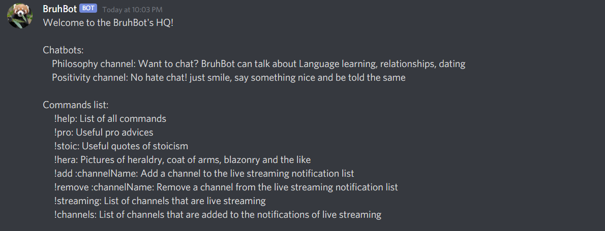

<h1 align="center">Discord Bot</h1>

Discord bot that use the Twitch and Reddit APIs, the goal of this bot is to provide a chatbot for servers, an auto moderator and notify about Twitch channels that are live streaming. The bot gets its answers from Reddit comments. By using [NLP.js](https://github.com/axa-group/nlp.js), the bot can guess the language (currently English and French) and react to the user's message by a '👍' for positivity and '👎' for negativity. User can add/remove Twitch channels to/from the notification list, also retrieve them and display those who are live streaming

## Features and commands


## Getting started

### Prerequisites
Make sure you have installed all of this prerequisites
- Git - [Download and install Git](https://git-scm.com/downloads)
- Node.js - [Download and install Node.js](https://nodejs.org/en/download/) which does also install NPM with it
- Docker - [Download and install Docker](https://www.docker.com/get-started)


### Installation
1. Register a [new app](https://dev.twitch.tv/console/apps)
2. Clone the repo ```git clone https://github.com/AmineAML/DiscordBot.git```
3. Install NPM packages ```npm install```
4. Rename `.env.example` file to `.env`
5. Generate an [Oauth]((http://twitchapps.com/tmi/)) and copy/paste it into `.env` file replacing the default value of OAUTH_TOKEN
6. Follow these steps to [Set up a bot](https://discordjs.guide/preparations/setting-up-a-bot-application.html) and copy/paste your Discord bot token into `.env` file replacing the default value of DISCORD_BOT_TOKEN
7. [Add the bot to a server](https://discordjs.guide/preparations/adding-your-bot-to-servers.html)

### Usage
Run the bot using ```npm run up```
* A notification will ask you if you want to share `mongo-init.sh` file with Docker. Accept it

## Docs
- [Twitch API](https://dev.twitch.tv/docs/)
- [Discord.ts repo and docs](https://github.com/OwenCalvin/discord.ts)
- [Discord.js docs](https://discordjs.guide/#before-you-begin) and also [Discord.js docs](https://discord.js.org/#/docs/main/stable/general/welcome)

## License
[MIT](https://github.com/AmineAML/DiscordBot/blob/main/LICENSE)